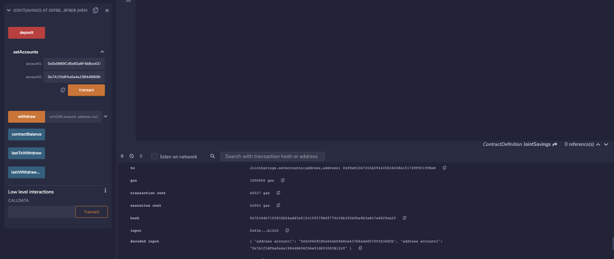
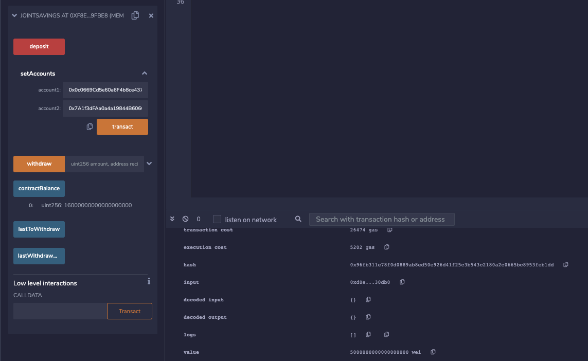
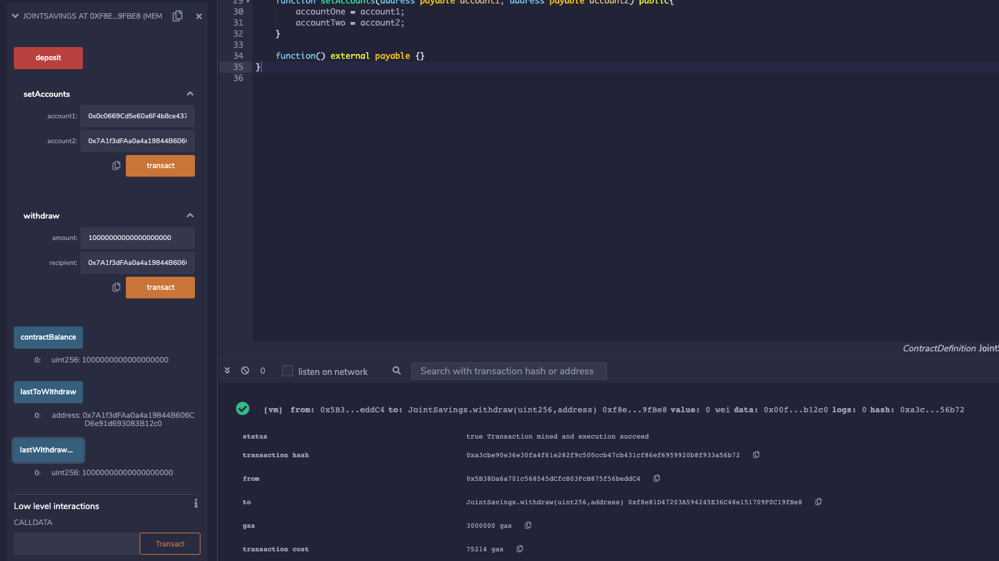

# Module 20 Challenge

This is the repository for my module 20 challenge. In this module challenge, we built a smart contract that allows us to host joint savings accounts.  

To automate the creation of joint savings accounts, we created a Solidity smart contract that accepts two user addresses. These addresses are able to control a joint savings account. 

My smart contract uses ether management functions to implement a financial institution’s requirements for providing the features of the joint savings account. These features consist of the ability to deposit and withdraw funds from the account.

---

## Technologies

This is the smart contract code in the Solidity file:

```python
pragma solidity ^0.5.0;

contract JointSavings {
    address payable accountOne;
    address payable accountTwo;
    address public lastToWithdraw;
    uint public lastWithdrawAmount;
    uint public contractBalance;

    function withdraw(uint amount, address payable recipient) public {

        require(recipient == accountOne || recipient == accountTwo, "You don't own this account!");

        require(contractBalance >= amount, "Insufficient funds!");

        if (lastToWithdraw != recipient) {
            lastToWithdraw = recipient;
        }

        recipient.transfer(amount);
        lastWithdrawAmount = amount;
        contractBalance = address(this).balance;
    }

    function deposit() public payable {
        contractBalance = address(this).balance;
    }

    function setAccounts(address payable account1, address payable account2) public{
        accountOne = account1;
        accountTwo = account2;
    }

    function() external payable {}
}
```

---

## Examples

#### This first shows the Remix IDE after we define the addresses for the joint account.




#### In this image, we see the total Ether smart contract balance (in wei) after depositing 16 ether into the smart contract.




#### Here we see a transaction where we withdraw 10 ether into account 2.




#### This final image shows a list of the transactions in the Remix IDE.


---

## Contributors

UCB Fintech Bootcamp, Wynham Guillemot 

---

## License

MIT License

Copyright (c) [2021] [UCB Fintech Bootcamp, Wyham Guillemot]

Permission is hereby granted, free of charge, to any person obtaining a copy
of this software and associated documentation files (the "Software"), to deal
in the Software without restriction, including without limitation the rights
to use, copy, modify, merge, publish, distribute, sublicense, and/or sell
copies of the Software, and to permit persons to whom the Software is
furnished to do so, subject to the following conditions:

The above copyright notice and this permission notice shall be included in all
copies or substantial portions of the Software.

THE SOFTWARE IS PROVIDED "AS IS", WITHOUT WARRANTY OF ANY KIND, EXPRESS OR
IMPLIED, INCLUDING BUT NOT LIMITED TO THE WARRANTIES OF MERCHANTABILITY,
FITNESS FOR A PARTICULAR PURPOSE AND NONINFRINGEMENT. IN NO EVENT SHALL THE
AUTHORS OR COPYRIGHT HOLDERS BE LIABLE FOR ANY CLAIM, DAMAGES OR OTHER
LIABILITY, WHETHER IN AN ACTION OF CONTRACT, TORT OR OTHERWISE, ARISING FROM,
OUT OF OR IN CONNECTION WITH THE SOFTWARE OR THE USE OR OTHER DEALINGS IN THE
SOFTWARE.
